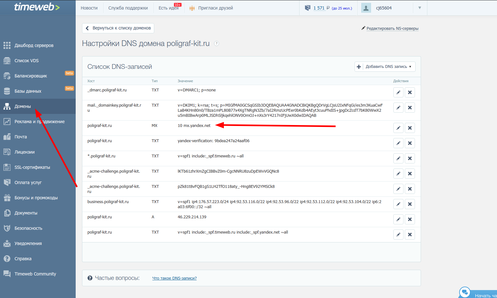
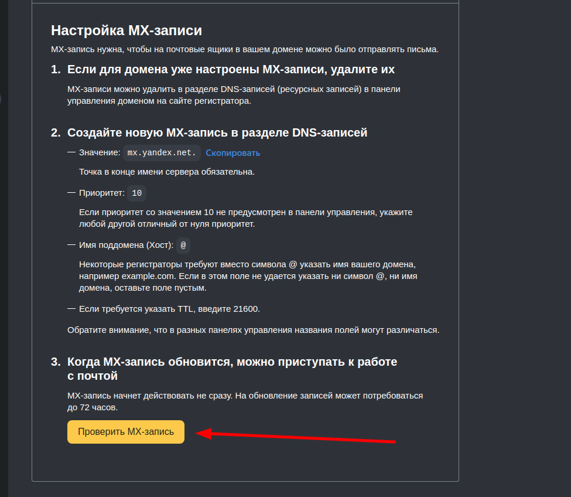

# Настройка отправки почты по SMTP (Яндекс)

## Назначение##

Настройка SMTP позволяет отправлять уведомления с сайта с корпоративного ящика (@название_домена)
без риска, что письмо попадет в спам.

## Модуль##

Нам нужен модуль "Отправка почты через SMTP" от wsrubi. Он устанавливается стандартно из Маркетплейс:

Переходим по ссылке на модуль - https://marketplace.1c-bitrix.ru/solutions/wsrubi.smtp/

Нажимаем "Установить"

Вводим адрес сайта и жмем "Установить".

Авторизируемся, Переходим на вкладку "Список обновлений" и нажимаем "Загрузить"

Далее переходим в настройки модуля

Прописываем в init.php нужную строчку и перезагружаем страницу

## Создание почтового ящика##

Переходим на страницу Яндекс.Коннект в режиме инкогнито или в другом браузере 
(главное чтобы вы не были авторизованы в Яндекс) - https://business.yandex.ru/mail360/tariff?utm_source=connect_promo

Далее создаем пользователя в Яндекс на имя клиента без использования номера телефона (через секретный вопрос).
Логин, пароль, а также секретный вопрос и ответ на него нужно сохранить, чтобы потом передать клиенту.

## Добавление домена##

После регистрации, нужно добавить наш домен и подтвердить его любым удобным способом из представленных

MX-запись делается только через настройки DNS (как правило на стороне хостинга), например fisrtVDS

DKIM-запись также рекомендуется сделать

## Создание корпоративного ящика##

Переходим во вкладку "Пользователи" и нажимаем "Добавить пользователя"

Заполняем данными клиента. Логин и пароль также необходимо сохранить.

После этого, необходимо авторизоваться под новым пользователем и завершить регистрацию

## Настройка SMTP##

Возвращаемся в настройки модуля и выбираем профиль "Яндекс"

Указываем логин и пароль от созданного ящика (с доменом сайта)

Нажимаем "Применить"

Далее проверяем работоспособность функционала. Для этого указываем ящик отправителя и получателя,
а потом нажимаем "Сохранить" (не "Проверить")

После перезагрузки страницы нажимаем "Проверить". Если все хорошо, то переходим к следующему этапу.
В случае возникновения ошибок, необходимо ознакомиться с содержанием ошибки и исправить ее.

Также не забудьте указать адрес отправителя в настройках сайта и главного модуля.

## Тестирование качества письма##

В первую очередь необходимо перейти на сайт https://www.mail-tester.com/ после чего скопировать предложенную ссылку и вставить
ее в поле получателя в настройках модуля SMTP

Далее сохраняем и нажимаем "Проверить". После этого возвращаемся на сайт-тестеровщик и нажимаем "Затем проверьте оценку"
Мы получим отчет с баллами (рекомендуется 8+ баллов).

В разных ситуациях результат может быть разный. По возможности нужно выполнить рекомендации тестировщика (особенно те, что отнимают баллы, они помечены красным)

Как правило, достаточно будет выполнить рекомендацию по настройке SPF-записи, DKIM-записи и DMARC-записи.
Эти записи прописываются в настройках DNS домена (см. пункт "Добавление домена")

После выполнения всех рекомендаций еще раз проверяем письмо тестировщиком.

## Заключение##

Настройка отправки почты по SMTP рекомендуется делать на каждом проекте, так как это повышает безопасность письма и 
понижает шансы на попадание такого письма в спам. Также нужно иметь ввиду, что если поменяется пароль от почтового ящика отправителя, пароль также нужно будет сменить в настройках модуля SMTP.
